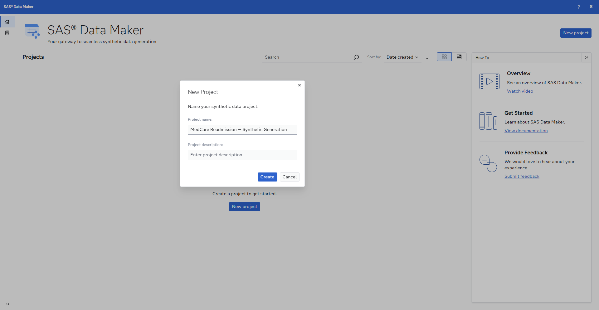
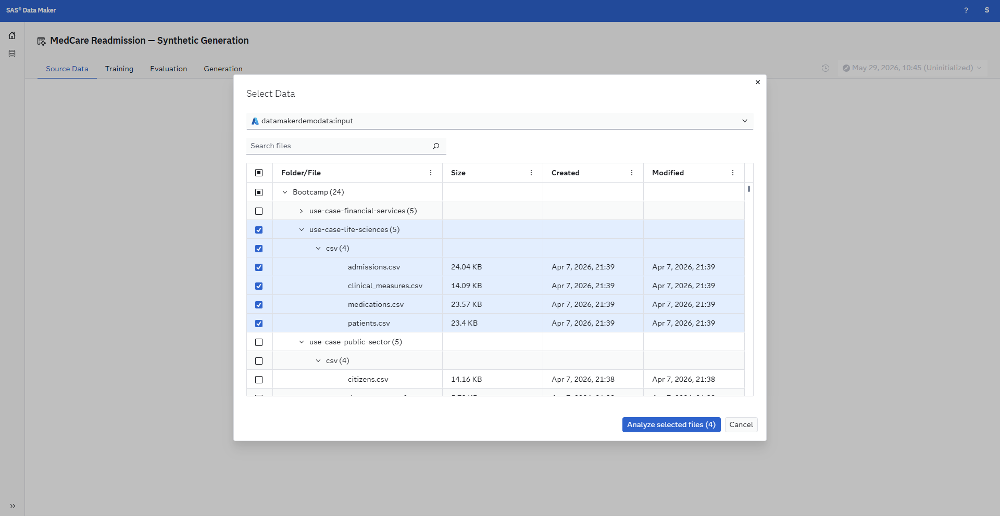
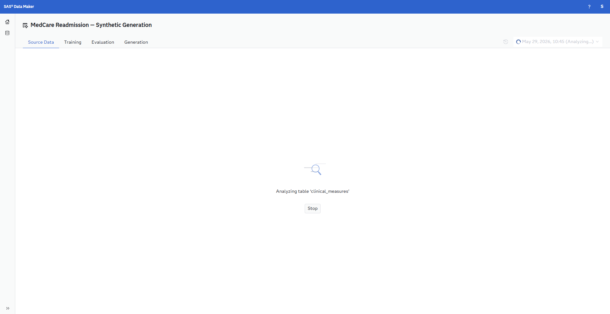
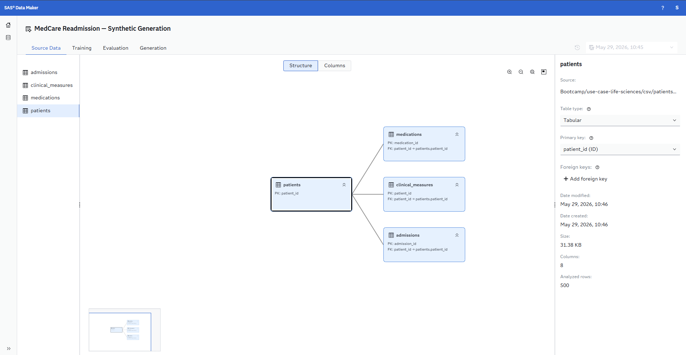
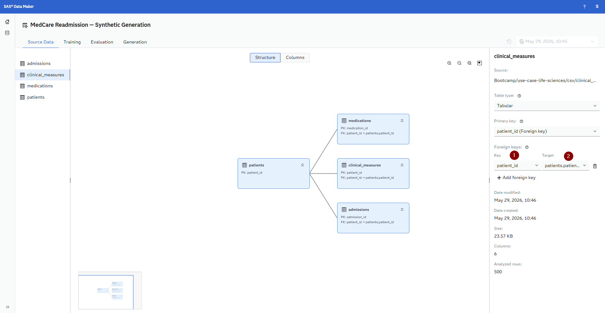
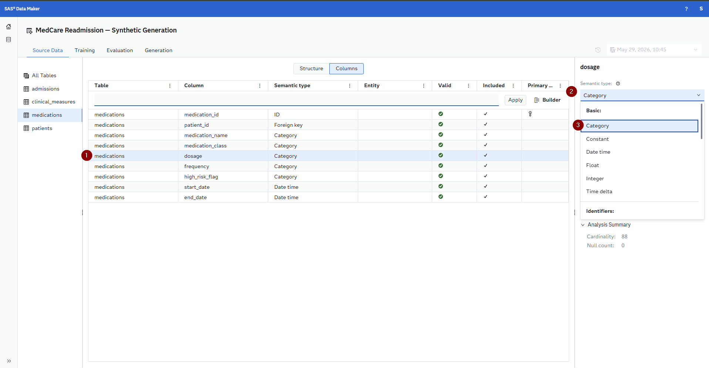
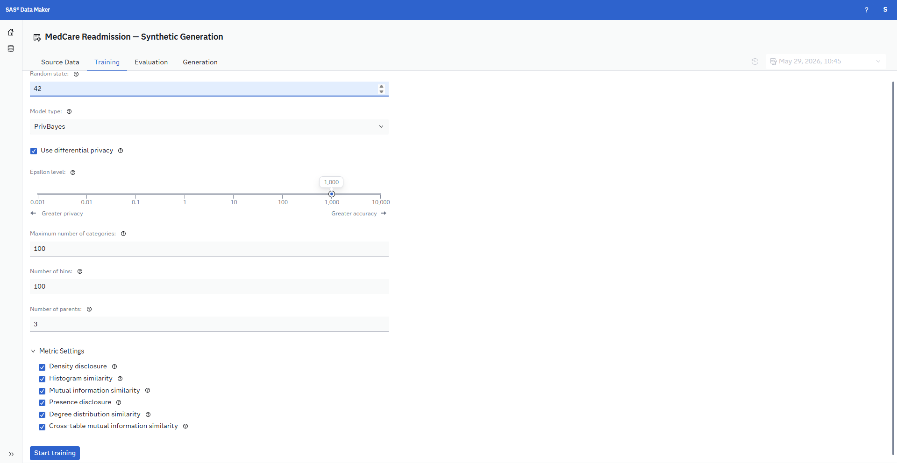
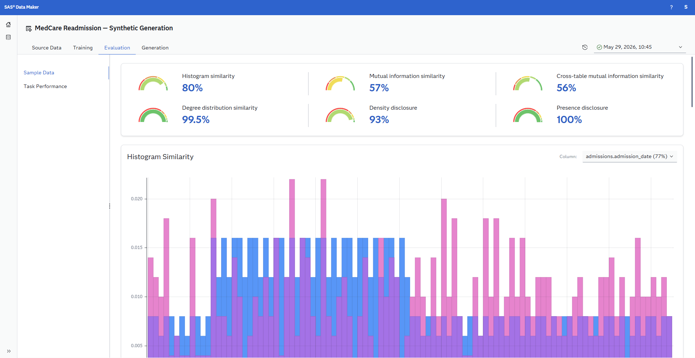
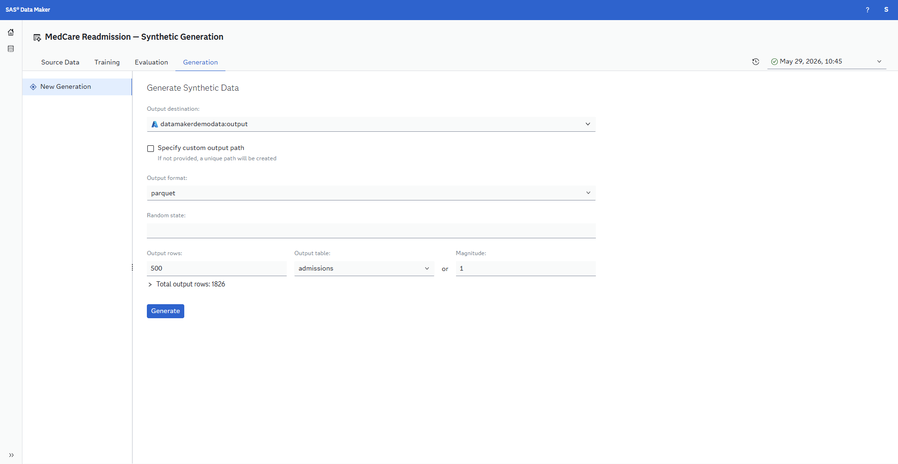
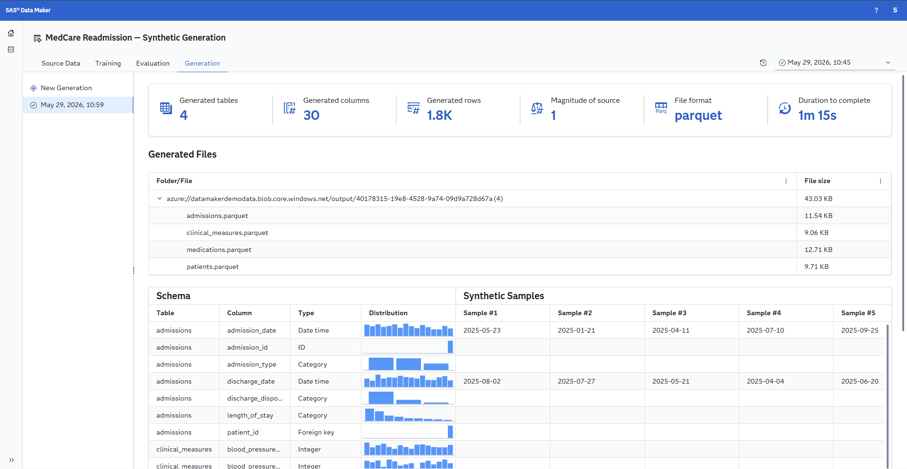

# Step 1: Ask & Access

Bienvenue chez **MedCare Health System**, un réseau régional de santé fictif. À cette étape, vous découvrirez les défis métier actuels, apprendrez la valeur des données synthétiques dans le domaine de la santé, et chargerez vos données dans **SAS Data Maker** afin de générer une version synthétique du jeu de données.

---

## Contexte réglementaire

L’analytique de santé est soumise à une supervision réglementaire et éthique stricte. Les principales réglementations applicables à ce cas d’usage incluent :

| Réglementation | Exigences |
|-----------|-----------------|
| **HIPAA** (Health Insurance Portability and Accountability Act) | Protège les informations de santé des patients ; impose des mesures de sécurité pour l’accès, l’utilisation et la divulgation des données de santé protégées (PHI) |
| **HITECH Act** |  Renforce l’application de la HIPAA ; impose la notification des violations en cas de données de santé non sécurisées |
| **CMS HRRP** (Hospital Readmissions Reduction Program) | Pénalise les hôpitaux présentant des taux de réadmission excessifs pour certaines pathologies ; constitue une motivation directe pour ce cas d’usage |
| **Joint Commission Standards** |  Exige des processus de transition des soins fondés sur des preuves et la mesure de la qualité |

Ces réglementations impliquent qu’au-delà de la construction d’un modèle précis, le workflow analytique doit protéger la confidentialité des patients, produire des résultats interprétables d’un point de vue clinique, et soutenir la documentation d’amélioration de la qualité exigée par le CMS et les organismes d’accréditation. 

---

## La valeur des données synthétiques

Les données synthétiques sont des données générées artificiellement qui **reproduisent les propriétés statistiques, les patterns et la structure de données réelles — sans contenir aucun enregistrement issu du jeu de données original**. Elles sont produites à l’aide de modèles génératifs capables d’apprendre les distributions, les corrélations et les relations présentes dans les données réelles, puis de créer de nouveaux enregistrements entièrement originaux, **représentatifs sur le plan statistique mais impossibles à rattacher à un individu spécifique**. Ces dernières années, les données synthétiques sont devenues un outil essentiel dans de nombreux secteurs, alors que les organisations font face à une pression croissante liée à la confidentialité des données, à la conformité réglementaire et au défi pratique d’obtenir des données de haute qualité en quantité suffisante pour l’analytique et le machine learning.

Pour un cas d’usage comme la prédiction des réadmissions de patients chez MedCare Health System, les données synthétiques offrent plusieurs avantages concrets particulièrement importants dans le secteur de la santé. Tout d’abord, elles permettent aux équipes de développer, tester et itérer sur des modèles sans exposer d’informations de santé protégées (PHI) — une exigence fondamentale dans le cadre de la HIPAA. Les dossiers réels des patients, contenant des diagnostics, des traitements, des signes vitaux et des informations d’assurance, font partie des catégories de données les plus sensibles qui existent ; la génération synthétique élimine totalement le risque de ré‑identification, permettant ainsi aux analystes, data scientists et collaborateurs externes de travailler librement, sans nécessiter d’accords de type Business Associate Agreements ni de processus de désidentification.Deuxièmement, les données synthétiques peuvent enrichir des scénarios cliniques sous‑représentés : si le jeu de données contient très peu de cas de réadmission pour des patients présentant des diagnostics rares ou des combinaisons inhabituelles de comorbidités, la génération synthétique peut produire des exemples supplémentaires réalistes afin d’améliorer l’entraînement des modèles sur ces cas limites.

Third, it enables multi-site collaboration — hospitals across the MedCare network, external research partners, and technology vendors can all work with realistic clinical data without the legal and ethical overhead of sharing actual patient records. Finally, synthetic data supports clinical simulation: what if readmission rates doubled for cardiac patients? What if a new high-risk medication class entered formulary? These scenarios can be modeled synthetically before they materialize, enabling proactive care pathway design.

---

## Working with SAS Data Maker

[SAS Data Maker](https://www.sas.com/en_us/software/data-maker.html) is the SAS platform for generating high-quality synthetic data. In this section you will pull the MedCare datasets into SAS Data Maker and create a synthetic version that preserves the statistical relationships across all four tables.

### Log into SAS Data Maker

The SAS Hackathon Bootcamp mentors will provide you with three links, a username and a password. Your username and password are consistent across all three environments. In order to access SAS Data Maker please enter the link that contains the word Data Maker. Here you will be asked to sign in using an Username/E-Mail and then enter a password - these are the once provided to you by the mentors. Please note if you have a SAS Communities profile do not log in using those credentials and if you see an error trying to log in, try to use an incognito browser tab, as you might still be logged into SAS somewhere.

### Generating Synthetic Data with SAS Data Maker

Follow these steps to create your synthetic dataset:

#### 1. Create a Project

1. Open **SAS Data Maker**
2. Click **New project** to start a new project
3. Give it a descriptive name, e.g., *MedCare Readmission — Synthetic Generation*
    

#### 2. Import Source Data

1. Within your data plan, click **Add Data Source**
2. Navigate to the `Bootcamp/use-case-life-sciences/csv` folder
3. This will import all four CSV files:
   - `patients.csv` — this is your primary entity table
   - `admissions.csv` — related table linked by `patient_id`
   - `clinical_measures.csv` — related table linked by `patient_id`
   - `medications.csv` — child table linked by `patient_id` (multiple medications per patient)
4. SAS Data Maker will profile each table and display column types, distributions, and summary statistics

Next you will see a loading bar like the one below that, this should finish in less than two minutes - feel free to start reading the next step already while you wait for this to finish:

#### 3. Define Relationships

The job that ran to understand the tables also will try to resolve the relationships between the tables. Please review that the relationship is mapped correctly. Your goal is to map a relationship that looks like the one below, but initially it will not look like.

In order to connect the tables correctly please click on each table and then on the right hand side under *Foreign keys* change the *Key* and *Target* values as described below

1. For `patients` set `patient_id` as the Primary key
2. For `admissions` set `admission_id` as the Primary key and `patient_id` as the Foreign key mapping to `patients`
3. For `medications` set `medication_id` as the Primary key and `patient_id` as the Foreign key
4. For `clinical_measures` set `patient_id` as the Primary key
    
5. All tables are of the type Tabular
6. Review the key relationships between the tables:
   - `admissions.patient_id` -> `patients.patient_id`
   - `clinical_measures.patient_id` -> `patients.patient_id`
   - `medications.patient_id` -> `patients.patient_id`
7. Now switch to the *Columns* tab to adjust the *Semantic type* for the three columns in the `medications` table `medication_name`, `medication_class` & `dosage` to the type `Category`
    
8. These relationships ensure that the synthetic data maintains referential integrity — every synthetic admission will belong to a valid synthetic patient

#### 4. Training Settings

1.   **Random state**, is optional and can be set to a seed variable. Why not try a classic like 42?
2.   **Model type**, we can choose between `PrivBayes` and `SMOTE` , we will be using PrivBayes here to make use of the differential privacy feature
3.   **Use differential privacy**, this will help us to reduce the privacy impact on each individual in the data. Increasing the privacy is a great way to enhance your Trustworthy AI as it increases the trust in you as a data processor
4.   The rest of the values we can leave at the default values and click the Start training button. If you want to feel free to explore the options though in more detail there is inline hints, or reach out to one of the SAS Mentors on site.
5.   The training process will take a moment and once it is done and all the metrics are calculated we can move to the next step which is `Evaluation`

#### 5. Evaluation

On the Evaluation tab we get a lot of insights into our Synthetic Data Generation Model, how it compares to the input sources and not just on a per table basis but also across the different tables.

Please take your time and explore these results to gain an understanding of how closely the synthetic data will match the original data sources. Feel free to discuss these results in the group and also reach out to SAS Mentors on site if you have question or consult the [SAS Documentation](https://go.documentation.sas.com/doc/en/sdgcdc/v_001/sdgug/p0ki9glx7acxpyn1wttognicd7qi.htm).

#### 6. Generation

1. **Output destination**, select the path `datamakerdemodata:output` here and set the *Output format* to one that you prefer (for example *parquet*)
2. Leave all other options at default and click the Generate button
    
3. Now a generation job is triggered that will create the synthetic data for each table for us and make that 
4. Once the generation has finished we get a summary of everything, a note on where the data is stored and a sample of the synthetic data. The generated data is stored onto a blob storage, don't worry you will not have to download anything onto your laptop as we will provide the data already available in SAS Viya and SAS Viya Workbench so that you can get to work.

---

## Next Steps

Proceed to **[Step 2: Prepare](../2-prepare/)** to load, profile, and join the data into an analytical base table using SAS Viya Workbench.
