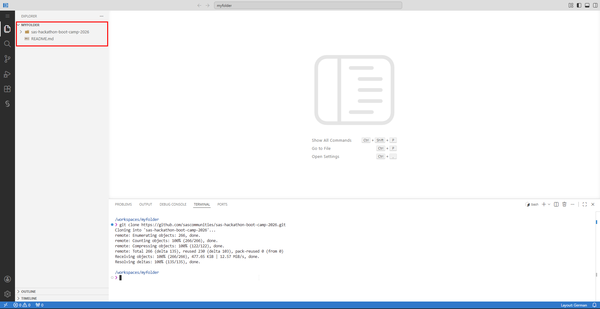

# Étape 2 : Prepare

Dans cette étape, vous allez travailler dans **SAS Viya Workbench** pour charger les quatre jeux de données Metro City, les profiler et les joindre dans une **Analytical Base Table (ABT)** prête pour l’exploration dans SAS Visual Analytics et la modélisation dans SAS Model Studio.

SAS Viya Workbench vous offre la liberté de coder dans le langage de votre choix. Nous fournissons un code équivalent en **SAS**, **Python** et **R** — choisissez celui avec lequel vous êtes le plus à l’aise ou essayez les trois.

---

---

## Accès aux données

Les quatre fichiers CSV sont disponibles dans la même structure de dossiers que dans l’Étape 1 :  

```
SAS-Hackathon-Bootcamp-2026/use-case-life-sciences/data
├── patients.csv          (500 lignes)
├── admissions.csv        (500 lignes)
├── clinical_measures.csv (500 lignes)
└── medications.csv       (326 lignes)
```

---


## Ce que vous allez faire

### 1. Configurer votre environnement dans SAS Viya Workbench

Une fois connecté à SAS Viya Workbench, vous devrez d’abord choisir l’environnement de programmation et les langages que vous souhaitez utiliser. Une fois cela fait, un second onglet s’ouvrira et vous devrez patienter jusqu’à ce que l’environnement s'affiche.

 

### 2. Charger les données et les cas d’usage

La première étape consiste à cloner le dépôt GitHub dans votre environnement SAS Viya Workbench en ouvrant un terminal et en exécutant la commande suivante :  

```bash
git clone https://github.com/sascommunities/sas-hackathon-boot-camp-2026.git
```

Si vous êtes dans Visual Studio Code, vous pouvez utiliser le raccourci clavier CTRL+´, ou suivre le chemin indiqué dans la capture ci-dessous :


Après avoir exécuté la commande git clone, vous devriez voir la structure de dossiers suivante. Naviguez ensuite vers votre cas d’usage et le dossier 2-prepare pour accéder aux fichiers.




### 3. Créer une Data Card

Une **data card** est un document synthétique décrivant chaque jeu de données — son objectif, sa taille, les noms de colonnes, les types de données et toute remarque de qualité. Les data cards sont une bonne pratique en matière d’IA responsable, car elles apportent de la transparence sur les données utilisées dans les modèles. Pour chaque table, vous produirez :

- Nombre de lignes et de colonnes
- Noms des colonnes et types de données
- Nombre de valeurs manquantes par colonne
- Exemples de lignes

### 4. Get Basic Summary Statistics

For numeric columns, compute descriptive statistics (mean, median, standard deviation, min, max). For categorical columns, compute frequency counts. This gives you a first look at distributions and potential data quality issues before you begin feature engineering.

### 5. Engineer Features and Build the Analytical Base Table

The four datasets each capture a different dimension of the patient encounter. To build a predictive model we need to aggregate these into a single patient-level table where each row is one patient and each column is a feature. The key transformations are:

- **Medication features:** total medication count per patient, high-risk medication count, polypharmacy flag (5+ medications), unique medication classes
- **Clinical features:** BMI categories (underweight/normal/overweight/obese), blood pressure classification (normal/elevated/hypertension stage 1/hypertension stage 2), glucose level categories, clinical risk score
- **Admission features:** length of stay categories (short/medium/long), emergency admission flag, discharge disposition encoding
- **Patient features:** age, gender, insurance type, primary diagnosis category, comorbidity count

The final ABT will be saved as a CSV file that can then be promoted into CAS for use in SAS Visual Analytics and SAS Model Studio.

---

## Choose Your Language

Pick **one** language and run its script. You do not need to run all three — they each produce the same output. If you are unsure which to choose, pick the one you are most comfortable with.

| Language | File | How to Run |
|----------|------|------------|
| **SAS** | [`data_preparation.sas`](data_preparation.sas) | Open the file and click the **Run** button in the toolbar above the editor |
| **Python** | [`data_preparation.py`](data_preparation.py) | Open the file and click the **Run** button in the toolbar above the editor |
| **R** | [`data_preparation.R`](data_preparation.R) | R scripts do not have a toolbar Run button. Open a terminal (*Terminal > New Terminal*) and run: `Rscript data_preparation.R` |

All three scripts produce the same output: a file called **`life_sciences_abt.csv`** in the `data/` folder. After the script finishes, **refresh the Explorer pane** to see the new file.

---

## Output

After running any of the scripts you will have:

| File | Description |
|------|-------------|
| `data/life_sciences_abt.csv` | The joined, feature-engineered, patient-level dataset ready for modeling |
| Console output | Data card information, summary statistics, and readmission distribution for review |

---

## Next Steps

Proceed to **[Step 3: Explore](../3-explore/)** to visually explore the data in SAS Visual Analytics using its built-in Copilot.
