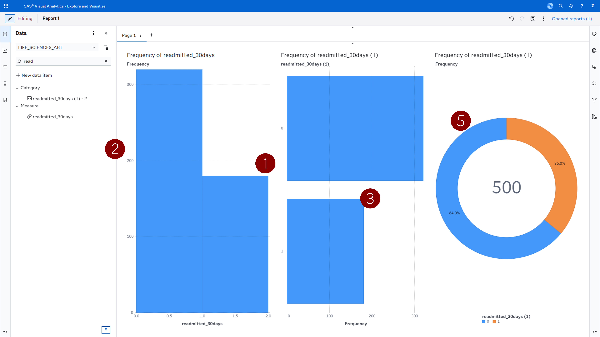
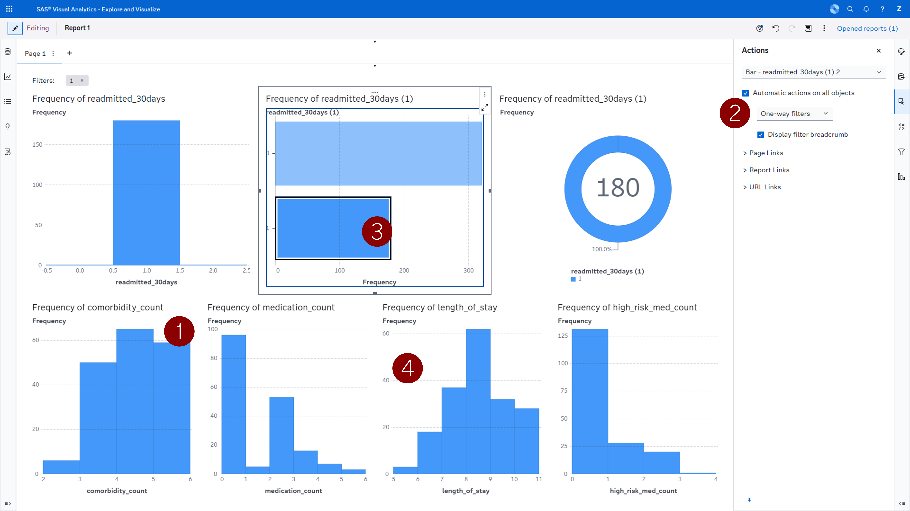
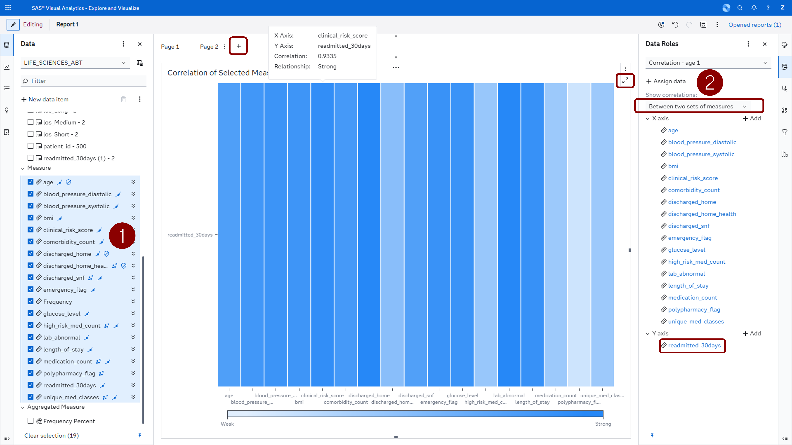
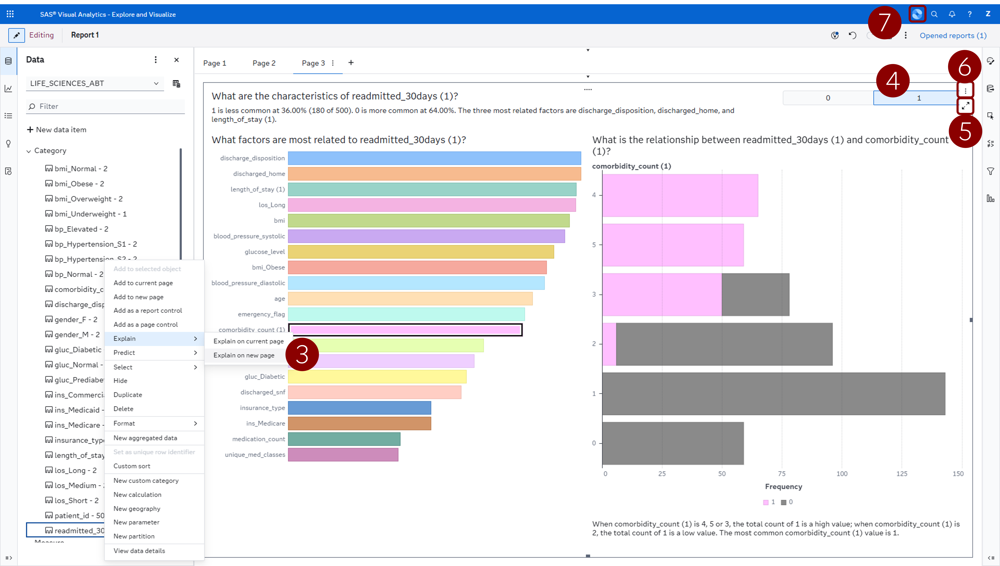

# Étape 3: Explore

Dans cette étape, vous utiliserez **SAS Visual Analytics** et son **Copilot** intégré pour explorer visuellement l’Analytical Base Table (ABT) que vous avez créée à l’Étape 2. L’objectif est de comprendre les facteurs qui expliquent les réadmissions des patients avant de construire un modèle prédictif.

---

## Prérequis

L’analytical base table doit déjà être chargée dans la bibliothèque CAS **Public**. Si vous avez terminé l’Étape 2, les données ont été enregistrées sous `life_sciences_abt.csv`. Votre environnement Bootcamp contient déjà cette table CAS préchargée sous le nom **`LIFE_SCIENCES_ABT`** dans la caslib **Public** .

---

## Accéder aux données dans SAS Visual Analytics

1. Ouvrez **SAS Visual Analytics** depuis la page d’accueil SAS Viya (ou via le menu principal en haut à droite → *Explore and Visualize*)
2. Cliquez sur **New Report**
3. Dans le panneau de données, cliquez sur Add Data et sélectionnez **LIFE_SCIENCES_ABT**  
    
4. Ajoutez-la comme source de données — vous devriez voir toutes les variables créées à l’Étape 2 dans le panneau de gauche

> **Astuce:** Si la table n’apparaît pas dans la caslib Public, demandez à un mentor SAS de vous aider à la promouvoir.
Vous pouvez aussi la charger directement en important le CSV via **Manage Data**.

---

## Exploration guidée

### Comprendre la variable cible

**Objectif :** Obtenir une compréhension de base de l'urgence dans le jeu de données.

- *"Quelle est la distribution des patients réadmis ?"*
- *"Quel est le pourcentage de patients réadmis dans les 30 jours ?"*

1. Faites glisser la variable cible `readmitted_30days` sur l’espace de travail. La visualisation est sélectionnée automatiquement en fonction du type de variable. Ici, il s’agit d’une variable numérique (mesure).
2. Dupliquez cette variable (clic droit : *Dupliquer*), puis convertissez-la en catégorie (clic droit : *Convertir en catégorie*).
3. Faites-la glisser à droite du premier graphique. Vous constaterez que la visualisation change. Sans modifier les données d’entrée, vous pouvez ainsi adapter le type de variable et accéder à différents types de graphiques.
4. Examinez l’équilibre des classes — cela orientera votre stratégie de modélisation à l’Étape 4.
5. *Optionnel : Créez un **diagramme circulaire** de la variable `readmitted_30days (1)`.*

   

### Relations avec d'autres variables

1. Faites glisser une autre variable de votre choix sur la même page.
2. Dans le menu de droite, cliquez sur la troisième icône (**Actions**) et cohez la case *Activer les actions automatiques*.
3. Cliquez ensuite sur une barre dans le deuxieme graphique. Observez comment l’ensemble des graphiques se met à jour. Grâce à cette interactivité, vous pouvez analyser les relations entre les variables ou construire des tableaux de bord interactifs.
4. *Optionnel : Tester d'autres variables. Observez comment leur distribution change en fonction de la catégorie séléctionnée. Vous pouvez explorer des segments précis comme « les patients couverts par Medicare ayant 3 comorbidités ou plus admis via le service des urgences ».*

   

### Matrice de correlation et la magie

**Objectif :** Identifier les facteurs qui influencent le plus la variable cible. Pour cela, utilisez la matrice de corrélation.  
1. Sélectionnez toutes les variables numériques (en maintenant la touche *Shift*), puis faites-les glisser sur le “+” à côté de la page 1. 
Cela ajoute une matrice de corrélation sur une nouvelle page. Vous pouvez agrandir (bouton en haut a droite à coté des 3 petits points) la vue pour mieux observer les relations.  
*Quelles variables sont les plus fortement corrélées à la variable cible `readmitted_30days` ?* 
3. Dans le menu de droite, cliquez sur la deuxième icône (**Rôles**) et sélectionnez *Show correlations: Between two sets of measures*. Mettez la variable `readmitted_30days` dans la section *Y axis*. Vous verrez alors plus clairement les variables les plus corrélées avec la cible. Cependant, ces relations ne sont pas toujours faciles à interpréter. Utilisons maintenant les capacités magiques d’analyse automatisée de la plateforme.
   
4. Dans le volet **Données** à gauche, sélectionnez la variable cible que vous avez convertie en catégorie `readmitted_30days (1)`. Faites un clic droit, puis choisissez *Expliquer automatiquement sur une nouvelle page*.
5. Sur le nouvel objet, sélectionnez la cible = 1 (en haut à droite). Vous obtenez une analyse détaillée mettant en évidence les facteurs les plus influents.
6. Agrandissez la visualisation à l’aide de l’icône d’agrandissement (à côté des trois points en haut à droite). Parcourez les différents onglets, en particulier la section *screening*, qui indique pourquoi certaines variables ont été retenues ou écartées. Consultez également l’onglet des variables importantes.  
*C’est typiquement le type d’analyse qu’un data scientist réaliserait au début d’un projet. Réaliser cette étape en code prendrait plus de temps ; ici, vous pouvez vous concentrer sur l’interprétation des résultats et la prise de décision.*
8. Réduisez la vue, puis cliquez sur les trois points en haut à droite. Sélectionnez **Dupliquer sous Arbre de décision**. Faites glisser l’objet vers une nouvelle page pour disposer de plus d’espace.
   
9. Félicitations, vous venez d’entraîner votre premier modèle de machine learning dans SAS Viya !  
Vous pouvez demander au SAS Viya Copilot d’interpréter les résultats :  
-     Interpret the results of the decision tree.
-     Interpret the results of the Page 3
-     Which factors influence the readmissions `readmitted_30days (1)`?

---

## Utiliser le Copilot de SAS Visual Analytics

SAS Visual Analytics inclut un **Copilot** - un assistant IA qui accélère l’exploration des données. L’icône du Copilot se trouve en haut à droite. Il peut :

- **Suggérer des visualisations** selon les variables sélectionnées
- **Répondre à des questions** sur vos données en langage naturel
- **Générer des insights** en détectant automatiquement des schémas intéressants
- **Créer des graphiques** à partir de requêtes en langage courant 

### Comment utiliser le Copilot

1. Cliquez sur l’icône **Copilot** pour ouvrir le panneau
2. Tapez une question ou une demande en langage naturel **(en anglais)**
3. Le Copilot suggère ou crée une visualisation dans votre rapport ou interprete les résultats
4. Vous pouvez affiner le résultat avec des requêtes supplémentaires
5. Un clic droit dans le panneau de chat vous propose des suggestions de prompts pour vous aider.

### Conseils et mises en garde Copilot

Quelques comportements à garder à l’esprit lors de cette étape :

- **Référez‑vous aux colonnes par leur nom exact.** Les requêtes (prompts) de ce guide utilisent des noms de colonnes entourés d’accents graves  (e.g., `` `readmitted_30days` ``, `` `comorbidity_count` ``). Copilot fonctionne mieux lorsque vous faites la même chose. Des termes vagues comme *"district"* ou *"request type"*  échouent souvent, car ces colonnes brutes n’existent pas dans l’ABT.
- **Les graphiques apparaissent parfois sur une autre page.** Si une visualisation générée apparaît sur une autre page du rapport, faites‑la glisser vers la page sur laquelle vous travaillez.
- **Ignorez les suggestions visant à reclasser des mesures numériques en catégories.** Copilot recommande parfois de transformer des colonnes numériques (e.g., `comorbidity_count`) en catégories. Dupliquez ces variables et convertissez les variables dupliquées en catégories.
- **Si un graphique ne répond pas à la question, reformulez.** Demandez à Copilot un type de graphique précis et des rôles de colonnes précis plutôt qu’une question ouverte (e.g., *"Crée un diagramme en barres avec `comorbidity_count` sur l'axe x et la moyenne de `readmitted_30days` sur l'axe y"*).

---

## Optionnel : Exploration en autonomie
Vous pouvez désormais explorer les données par vous‑même. Essayez de créer des visualisations manuellement **et/ou** via le Copilot. 
Voici quelques pistes d’analyse :  
- `comorbidity_count` et `readmitted_30days` : les patients réadmis devraient présenter un nombre moyen de comorbidités plus élevé. Recherchez un effet de seuil — le risque peut s’accélérer au-delà d’un certain nombre de pathologies.  
- `length_of_stay` et `readmitted_30days` : les séjours très courts (potentiellement liés à une sortie prématurée) et les séjours très longs (patients très graves) peuvent tous deux être associés à un risque élevé, créant ainsi une forme en U.  
- `emergency_flag` et `readmitted_30days` : les admissions en urgence devraient présenter un taux de réadmission significativement plus élevé que les admissions programmées, reflétant une planification de sortie moins maîtrisée.
- `medication_count`, `high_risk_med_count` et `readmitted_30days` : les patients prenant davantage de médicaments — en particulier des médicaments à haut risque — devraient présenter des taux de réadmission plus élevés en raison des difficultés d’observance et des risques d’interactions médicamenteuses.
- `blood_pressure_systolic`, `glucose_level`, `bmi` et `readmitted_30days` : les patients présentant des résultats de laboratoire anormaux, une hypertension, une glycémie de type diabétique ou des valeurs extrêmes d’IMC devraient montrer un risque de réadmission plus élevé. Le composite `clinical_risk_score` devrait présenter une relation dose-réponse claire avec la réadmission.
- Le Copilot peut mettre en évidence des interactions que vous n’auriez pas examinées manuellement, comme par exemple : « les patients avec un nombre élevé de comorbidités ET une admission en urgence ET une polymédication ont une probabilité de réadmission supérieure à 60 % ».

---

## Considérations HIPAA pour les visualisations

Lors de la création de tableaux de bord et de rapports à partir de données patients, gardez ces principes à l’esprit :

- **Évitez les cellules de petite taille:** Si une combinaison de filtres aboutit à moins de 10 patients, masquez le résultat afin de prévenir toute ré-identification potentielle.
- **Agrégerez sans afficher les données individuelles:** Présentez des distributions et des moyennes, et non des données au niveau patient.
- **Contrôle d’accès basé sur les rôles:** Lors de la publication des rapports, assurez-vous que l’accès est restreint au personnel clinique et administratif autorisé.
- **Pistes d’audit:** SAS Visual Analytics enregistre tous les accès aux rapports et les requêtes de données — cela contribue à la conformité aux exigences HIPAA.
- **Désidentification:** Les données synthétiques issues de l’étape 1 éliminent entièrement ces préoccupations — un avantage clé du workflow SAS Data Maker.

  
---

N'hésitez pas à enregistrer le rapport. L'emplacement par défaut est "Mon dossier" (My Folder), ce qui est idéal ici pour ne pas encombrer l'espace de travail des autres. Vous pouvez également lui donner un nom afin qu'il soit plus facile de vous rappeler le sujet de ce rapport.

---

## Étapes suivantes

Passez à **[Étape 4: Model](../4-model/)** pour construire des modèles prédictifs de manière plus industrielle, en intégrant le prétraitement des données et la comparaison de plusieurs modèles dans **SAS Model Studio**.
