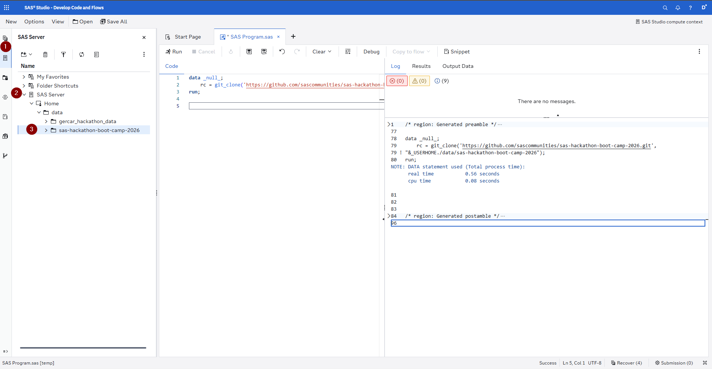

# Étape 2: Prepare

Dans cette étape, vous allez travailler dans **SAS Studio** pour charger les quatre jeux de données Metro City, les profiler et les joindre dans une **Analytical Base Table (ABT)** prête pour l’exploration dans SAS Visual Analytics et la modélisation dans SAS Model Studio.

SAS Studio vous offre la liberté de coder dans le langage de votre choix. Nous fournissons un code équivalent en **SAS**, **Python**, and **R** — choisissez celui avec lequel vous êtes le plus à l’aise ou essayez les trois.

---

## Accès aux données

Les quatre fichiers CSV sont disponibles dans la même structure de dossiers que dans l’Étape 1 :

```
SAS-Hackathon-Bootcamp-2026/use-case-public-sector/data
├── service_requests.csv         (500 enregistrements)
├── citizens.csv                 (300 enregistrements)
├── department_performance.csv   (96 enregistrements)
└── request_history.csv          (~3,456 enregistrements)
```

---

## Ce que vous allez faire

### 1. Charger les données et les cas d’usage

La première étape consiste à cloner le dépôt GitHub dans votre environnement SAS Studio en ouvrant un terminal et en exécutant la commande suivante :

Maintenant, dans un premier temps, vous allez cloner le dépôt GitHub dans votre environnement SAS Studio en ouvrant d’abord un programme SAS et en exécutant le code ci‑dessous, qui clonera le dépôt dans le système de fichiers.

```SAS
data _null_;
    rc = git_clone('https://github.com/sascommunities/sas-hackathon-boot-camp-2026.git', "&_USERHOME./sas-hackathon-boot-camp-2026");
run;
```

Une fois cet extrait de code exécuté, accédez au panneau SAS Server, puis développez *SAS Server > Home > data > sas-hackathon-bootcamp-2026*. À partir de là, la structure familière de ce dépôt est disponible.



### 2. Créer une Data Card

Une **data card** est un document synthétique décrivant chaque jeu de données — son objectif, sa taille, les noms de colonnes, les types de données et toute remarque de qualité. Les data cards sont une bonne pratique en matière d’IA responsable, car elles apportent de la transparence sur les données utilisées dans les modèles. Pour chaque table, vous produirez :

- Nombre de lignes et de colonnes
- Noms des colonnes et types de données
- Nombre de valeurs manquantes par colonne
- Exemples de lignes

### 3. Obtenir des statistiques descriptives de base

Pour les colonnes numériques, calculez les statistiques descriptives (moyenne, médiane, écart-type, min, max). Pour les colonnes catégorielles, calculez les fréquences. Cela vous donne une première vue des distributions et des éventuels problèmes de qualité avant de commencer le feature engineering.

### 4. Engineer Features et construire l'Analytical Base Table

Les quatre jeux de données capturent chacun une dimension différente de la prestation de services de Metro City. Pour construire un modèle prédictif, nous devons les combiner en une seule table au niveau des demandes, où chaque ligne correspond à une demande de service et chaque colonne à une caractéristique. Les transformations clés sont :

- **Caractéristiques temporelles:**  jour de la semaine, indicateur week-end, mois, trimestre extrait de la date de soumission
- **Caractéristiques de la demande:** encodage du type de demande, indicateur d’urgence propre au type de demande
- **Caractéristiques des départements:** temps de réponse moyen, taux de résolution, nombre d'employés, et charge de travail issus des données de performance du département
- **Caractéristiques des quartiers:** volume de demandes et schémas historiques de réponse basés sur l’historique des demandes
- **Caractéristiques des citoyens:** nombre de demandes précédentes, historique de satisfaction, score d’engagement, ancienneté du compte

La variable cible `is_urgent` est dérivée de `priority_level`: 1 si la priorité est Critique ou Élevée, 0 sinon.

L’ABT finale sera enregistrée en fichier CSV, puis pourra être promue dans CAS pour une utilisation dans SAS Visual Analytics et SAS Model Studio.

---

## Choisissez votre langage

Choisissez **un** langage et exécutez son script. Vous n’avez pas besoin d’exécuter les trois — ils produisent tous le même résultat. Si vous hésitez, prenez celui que vous maîtrisez le mieux.

| Langage   | Fichier                                                         |
| ---------- | ------------------------------------------------------------ |
| **SAS**    | [`data_preparation_studio.sas`](data_preparation_studio.sas) |
| **Python** | [`data_preparation_studio.py`](data_preparation_studio.py)   |
| **R**      | [`data_preparation_studio.R`](data_preparation_studio.R)     |

Les trois scripts produisent le même fichier : **`public_sector_abt.csv`** dans le dossier `data/`. Après exécution, **rafraîchissez le panneau Explorer** pour voir le nouveau fichier.

---

## Résultat

Après avoir exécuté l’un des scripts, vous obtiendrez :

| Fichier | Description |
|------|-------------|
| `data/public_sector_abt.csv` | Le jeu de données join, feature-engineered, et prêt pour la modélisation au niveau des demandes |
| Sortie console | Informations de data card, statistiques descriptives, et distribution du niveau d’urgence pour revue |

---

## Prochaines étapes

Passez à **[Étape 3: Explore](../3-explore/)** pour explorer visuellement les données dans SAS Visual Analytics grâce à son Copilot intégré.
