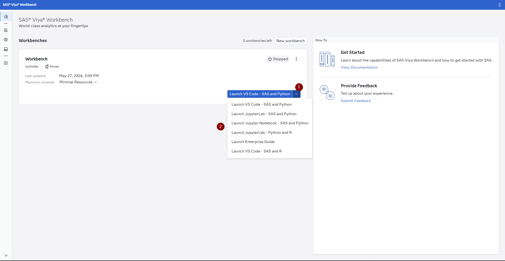
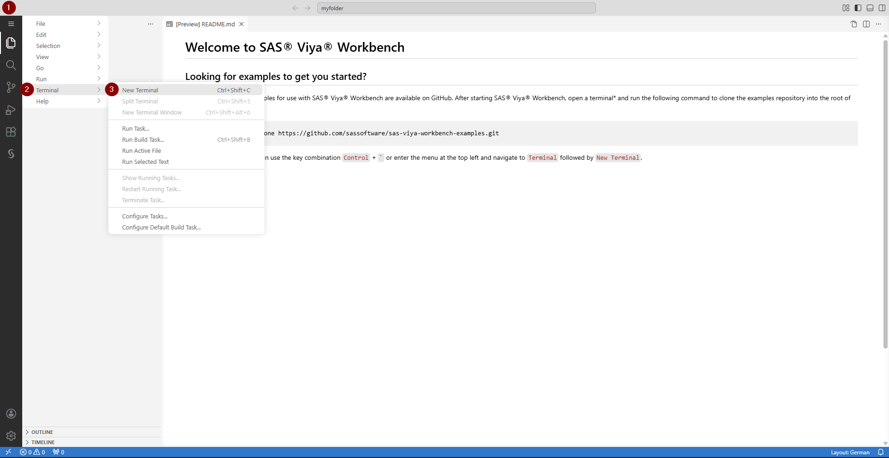

# Étape 2: Prepare

Dans cette étape, vous allez travailler dans **SAS Viya Workbench** pour charger les quatre jeux de données ShopEase, les profiler et les joindre dans une **Analytical Base Table (ABT)** prête pour l’exploration dans SAS Visual Analytics et la modélisation dans SAS Model Studio.

SAS Viya Workbench vous offre la liberté de coder dans le langage de votre choix. Nous fournissons un code équivalent en **SAS**, **Python** et **R** — choisissez celui avec lequel vous êtes le plus à l’aise ou essayez les trois.

---

## Accès aux données

Les quatre fichiers CSV sont disponibles dans la même structure de dossiers que dans l’Étape 1 :

```
SAS-Hackathon-Bootcamp-2026/use-case-retail/data
├── customers.csv          (1,000 enregistrements)
├── transactions.csv       (~5,000 enregistrements)
├── sessions.csv           (~10,000 enregistrements)
└── support_tickets.csv    (~400 enregistrements)
```

Dans SAS Viya Workbench, ouvrez une nouvelle session et naviguez vers le dossier `use-case-retail`. À partir de là, vous pouvez ouvrir n’importe lequel des fichiers de code fournis.

---

## Ce que vous allez faire

### 1. Configurer votre environnement dans SAS Viya Workbench

Une fois connecté à SAS Viya Workbench, vous devez d’abord choisir l’environnement de programmation que vous souhaitez utiliser ainsi que les langages. Une fois ce choix effectué, un second onglet s’ouvrira et vous devrez patienter un instant jusqu’à ce que l’environnement de programmation apparaisse. 

### 2. Charger les données et les cas d’usage

Dans un premier temps, clonez le dépôt GitHub dans votre environnement SAS Viya Workbench en ouvrant un terminal puis en exécutant la commande suivante :

```bash
git clone https://github.com/sascommunities/sas-hackathon-boot-camp-2026.git
```

Si vous êtes dans Visual Studio Code, vous pouvez essayer le raccourci clavier CTRL+´. Si cela ne fonctionne pas, suivez le chemin indiqué dans la capture ci-dessous :



Après avoir exécuté la commande git clone, vous devriez voir la structure de dossiers correspondante. À partir de là, naviguez vers votre cas d’usage puis dans 2-prepare pour voir les fichiers.


### 3. Créer une Data Card

Une **data card** est un document synthétique qui décrit chaque jeu de données — son objectif, sa taille, les noms de colonnes, les types de données et les éventuelles notes de qualité. Les data cards sont une bonne pratique d’IA responsable car elles apportent de la transparence sur les données utilisées dans les modèles. Pour chaque table, vous produirez :

- Nombre de lignes et de colonnes
- Noms des colonnes avec leurs types de données
- Nombre de valeurs manquantes par colonne
- Exemples de lignes

### 4. Obtenir des statistiques descriptives de base

Pour les colonnes numériques, calculez des statistiques descriptives (moyenne, médiane, écart-type, min, max). Pour les colonnes catégorielles, calculez les fréquences. Cela donne une première vue des distributions et des éventuels problèmes de qualité des données avant de commencer la feature engineering.

### 5. Faire de la feature engineering et construire l’Analytical Base Table

Les quatre jeux de données capturent chacun une dimension différente du comportement client. Pour construire un modèle prédictif, nous devons les agréger dans une table unique au niveau client, où chaque ligne représente un client et chaque colonne une variable. Les transformations clés sont :

- **Variables transactionnelles :** dépense totale, valeur moyenne de commande, fréquence d’achat, jours depuis le dernier achat, diversité des catégories produits
- **Variables de session :** nombre total de sessions, durée moyenne de session, pages vues, taux d’abandon panier, taux d’usage mobile
- **Variables de support :** nombre total de tickets, nombre de tickets haute priorité, temps moyen de résolution, score de satisfaction
- **Variables client :** âge, ancienneté du compte, niveau d’abonnement, statut d’opt-in e-mail

L’ABT finale sera enregistrée au format CSV, puis pourra être promue dans CAS pour une utilisation dans SAS Visual Analytics et SAS Model Studio.

---

## Choisissez votre langage

Choisissez **un** langage et exécutez son script. Vous n’avez pas besoin d’exécuter les trois — ils produisent tous la même sortie. Si vous hésitez, choisissez celui avec lequel vous êtes le plus à l’aise.

| Langage    | Fichier                                        | Comment exécuter                                                                                                                                        |
| ---------- | ---------------------------------------------- | ------------------------------------------------------------------------------------------------------------------------------------------------------- |
| **SAS**    | [`data_preparation.sas`](data_preparation.sas) | Ouvrez le fichier puis cliquez sur le bouton **Run** dans la barre d’outils au-dessus de l’éditeur                                                      |
| **Python** | [`data_preparation.py`](data_preparation.py)   | Ouvrez le fichier puis cliquez sur le bouton **Run** dans la barre d’outils au-dessus de l’éditeur                                                      |
| **R**      | [`data_preparation.R`](data_preparation.R)     | Les scripts R n’ont pas de bouton Run dans la barre d’outils. Ouvrez un terminal (_Terminal > New Terminal_) et exécutez : `Rscript data_preparation.R` |

Les trois scripts produisent la même sortie : un fichier appelé **`retail_abt.csv`** dans le dossier `data/`. Une fois le script terminé, **rafraîchissez le panneau Explorer** pour voir le nouveau fichier.

---

## Résultat

Après avoir exécuté l’un des scripts, vous obtiendrez :

| Fichier               | Description                                                                              |
| --------------------- | ---------------------------------------------------------------------------------------- |
| `data/retail_abt.csv` | Jeu de données joint, enrichi et au niveau client, prêt pour la modélisation             |
| Sortie console        | Informations de data card, statistiques descriptives et distribution du churn à examiner |

---

## Prochaines étapes

Passez à **[Étape 3: Explore](../3-explore/)** pour explorer visuellement les données dans SAS Visual Analytics avec son Copilot intégré.
