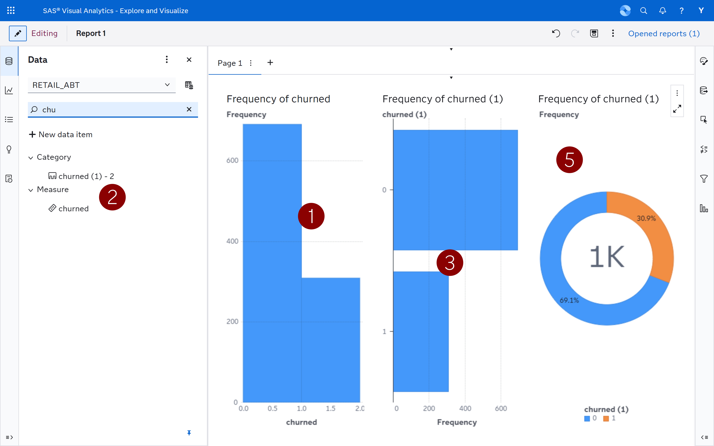
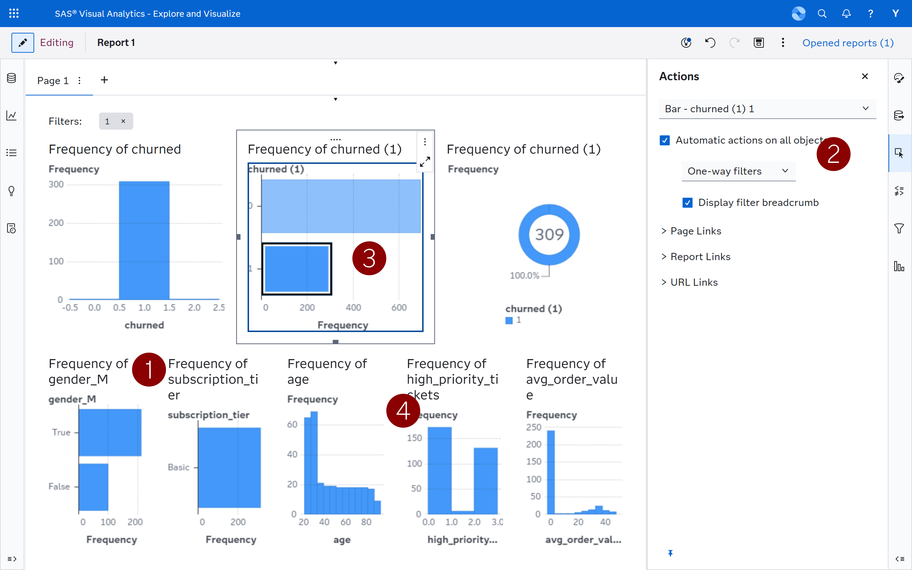
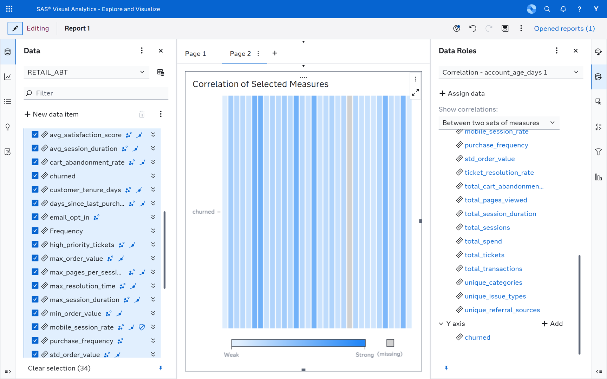
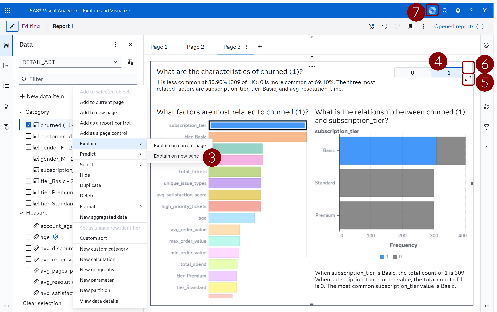

# Étape 3: Explore

Dans cette étape, vous utiliserez **SAS Visual Analytics** et son **Copilot** intégré pour explorer visuellement l’Analytical Base Table (ABT) que vous avez créée à l’Étape 2. L’objectif est de comprendre les facteurs qui expliquent l'attrition client avant de construire un modèle prédictif.

---

## Prérequis

La table de base analytique doit déjà être chargée dans la bibliothèque CAS **Public**. Si vous avez terminé l'étape 2, les données ont été enregistrées sous le nom `retail_abt.csv`. Votre environnement bootcamp contient déjà cette table CAS sous le nom **`RETAIL_ABT`** dans la caslib **Public**.

---

## Accéder aux données dans SAS Visual Analytics

1. Ouvrez **SAS Visual Analytics** depuis la page d'accueil SAS Viya (ou utilisez le menu principal en haut à droite puis cliquez sur _Explorer et visualiser_)
2. Cliquez sur **Nouveau rapport**
3. Dans le panneau de données, cliquez sur le bouton Add Data puis, parmi les tables disponibles, sélectionnez **RETAIL_ABT**
   
4. Ajoutez-la comme source de données — vous devriez voir toutes les variables de l'étape 2 listées dans le panneau des éléments de données à gauche

> **Astuce :** Si la table n'apparaît pas dans la caslib Public, demandez à votre mentor SAS de vous aider à la promouvoir. Vous pouvez aussi la charger directement en téléversant le CSV via l'interface **Manage Data**.

---

## Exploration guidée

### Comprendre la variable cible

**Objectif :** Obtenir une compréhension de base de l'attrition dans le jeu de données.

- *"Quelle est la distribution des clients en attrition ?"*
- *"Quel est le pourcentage de clients est en attritions ?"*

1. Faites glisser la variable cible `churned` sur l’espace de travail. La visualisation est sélectionnée automatiquement en fonction du type de variable. Ici, il s’agit d’une variable numérique (mesure).
2. Dupliquez cette variable (clic droit : *Dupliquer*), puis convertissez-la en catégorie (clic droit : *Convertir en catégorie*).
3. Faites-la glisser à droite du premier graphique. Vous constaterez que la visualisation change. Sans modifier les données d’entrée, vous pouvez ainsi adapter le type de variable et accéder à différents types de graphiques.
4. Examinez l’équilibre des classes — cela orientera votre stratégie de modélisation à l’Étape 4.
5. *Optionnel : Créez un **diagramme circulaire** de la variable `churned (1)`.*

   

### Relations avec d'autres variables

1. Faites glisser une autre variable de votre choix sur la même page.
2. Dans le menu de droite, cliquez sur la troisième icône (**Actions**) et cohez la case *Activer les actions automatiques*.
3. Cliquez ensuite sur une barre dans le deuxieme graphique. Observez comment l’ensemble des graphiques se met à jour. Grâce à cette interactivité, vous pouvez analyser les relations entre les variables ou construire des tableaux de bord interactifs.
4. *Optionnel : Tester d'autres variables. Observez comment leur distribution change en fonction de la catégorie séléctionnée. Vous pouvez explorer des segments précis comme  "les clients niveau Basic qui n'ont pas acheté depuis plus de 60 jours".*

   

### Matrice de correlation et la magie

**Objectif :** Identifier les facteurs qui influencent le plus la variable cible. Pour cela, utilisez la matrice de corrélation.  
1. Sélectionnez toutes les variables numériques (en maintenant la touche *Shift*), puis faites-les glisser sur le “+” à côté de la page 1. 
Cela ajoute une matrice de corrélation sur une nouvelle page. Vous pouvez agrandir (bouton en haut a droite à coté des 3 petits points) la vue pour mieux observer les relations.  
*Quelles variables sont les plus fortement corrélées à la variable cible `churned` ?* 
3. Dans le menu de droite, cliquez sur la deuxième icône (**Rôles**) et sélectionnez *Show correlations: Between two sets of measures*. Mettez la variable `churned` dans la section *Y axis*. Vous verrez alors plus clairement les variables les plus corrélées avec la cible. Cependant, ces relations ne sont pas toujours faciles à interpréter. Utilisons maintenant les capacités magiques d’analyse automatisée de la plateforme.
   
4. Dans le volet **Données** à gauche, sélectionnez la variable cible que vous avez convertie en catégorie `churned (1)`. Faites un clic droit, puis choisissez *Expliquer automatiquement sur une nouvelle page*.
5. Sur le nouvel objet, sélectionnez la cible = 1 (en haut à droite). Vous obtenez une analyse détaillée mettant en évidence les facteurs les plus influents.
6. Agrandissez la visualisation à l’aide de l’icône d’agrandissement (à côté des trois points en haut à droite). Parcourez les différents onglets, en particulier la section *screening*, qui indique pourquoi certaines variables ont été retenues ou écartées. Consultez également l’onglet des variables importantes.  
*C’est typiquement le type d’analyse qu’un data scientist réaliserait au début d’un projet. Réaliser cette étape en code prendrait plus de temps ; ici, vous pouvez vous concentrer sur l’interprétation des résultats et la prise de décision.*
8. Réduisez la vue, puis cliquez sur les trois points en haut à droite. Sélectionnez **Dupliquer sous Arbre de décision**. Faites glisser l’objet vers une nouvelle page pour disposer de plus d’espace.
   
9. Félicitations, vous venez d’entraîner votre premier modèle de machine learning dans SAS Viya !  
Vous pouvez demander au SAS Viya Copilot d’interpréter les résultats :  
-     Interpret the results of the decision tree.
-     Interpret the results of the Page 3
-     What are the key drivers of churn `churned (1)`?

---

## Utiliser le Copilot de SAS Visual Analytics

SAS Visual Analytics inclut un **Copilot** — un assistant IA qui vous aide à explorer les données plus rapidement. Vous pouvez trouver l'icône Copilot en haut à droite. Le Copilot peut :

- **Suggérer des visualisations** en fonction des variables que vous sélectionnez
- **Répondre à des questions** sur vos données en langage naturel
- **Générer des insights** en recherchant automatiquement des schémas intéressants
- **Créer des graphiques** à partir d'instructions en langage naturel

### Comment utiliser le Copilot

1. Cliquez sur l'icône **Copilot** pour ouvrir le panneau de l'assistant
2. Saisissez une question ou une demande en langage naturel
3. Le Copilot suggérera ou créera une visualisation directement dans votre rapport
4. Vous pouvez affiner le résultat en ajoutant d'autres instructions
5. Vous pouvez faire un clic droit dans le panneau de discussion pour obtenir des suggestions d'instructions afin de vous aider.

### Conseils et mises en garde Copilot

Quelques comportements à garder à l’esprit lors de cette étape :

- **Référez‑vous aux colonnes par leur nom exact.** Les requêtes (prompts) de ce guide utilisent des noms de colonnes entourés d’accents graves  (e.g., `` `churned` ``, `` `avg_days_late` ``). Copilot fonctionne mieux lorsque vous faites la même chose. 
- **Les graphiques apparaissent parfois sur une autre page.** Si une visualisation générée apparaît sur une autre page du rapport, faites‑la glisser vers la page sur laquelle vous travaillez.
- **Les suggestions visant à reclasser des mesures numériques en catégories.** Copilot recommande parfois de transformer des colonnes numériques (e.g., `credit_score`) en catégories. Dupliquez ces variables et convertissez les variables dupliquées en catégories.
- **Si un graphique ne répond pas à la question, reformulez.** Demandez à Copilot un type de graphique précis et des rôles de colonnes précis plutôt qu’une question ouverte (e.g., *"Crée un diagramme en barres avec `credit_score` sur l'axe x et la moyenne de `churned` sur l'axe y"*).

---

## Optionnel : Exploration en autonomie
Vous pouvez désormais explorer les données par vous‑même. Essayez de créer des visualisations manuellement **et/ou** via le Copilot. 
Voici quelques pistes d’analyse :  
- Les clients en attrition devraient avoir un nombre de sessions sensiblement plus faible et des durées de session plus courtes. `churned`, `avg_session_duration`, `total_sessions` et `avg_pages_per_session`
- Les clients en attrition ont probablement un `days_since_last_purchase` plus élevé et une `purchase_frequency` plus faible. Il s'agit souvent du prédicteur le plus fort.
- Des scores de satisfaction plus faibles et davantage de tickets haute priorité parmi les clients en attrition. `total_tickets`, `high_priority_tickets`
- Les clients du niveau Basic devraient présenter un taux d'attrition nettement plus élevé que les clients Premium.  `tier_Basic`, `tier_Standard`, `tier_Premium`
- Les clients qui se sont désinscrits des e-mails (email_opt_in = 0) devraient avoir une attrition plus élevée. `email_opt_in`.
- Le Copilot peut révéler des interactions que vous n'auriez pas vérifiées manuellement, par exemple : "les clients avec une faible durée de session ET un taux élevé d'abandon de panier ont une probabilité d'attrition de 90 %."

---

N'hésitez pas à enregistrer le rapport. L'emplacement par défaut est "Mon dossier" (My Folder), ce qui est idéal ici pour ne pas encombrer l'espace de travail des autres. Vous pouvez également lui donner un nom afin qu'il soit plus facile de vous rappeler le sujet de ce rapport.

---

## Étapes suivantes

Passez à **[Étape 4: Model](../4-model/)** pour construire des modèles prédictifs de manière plus industrielle, en intégrant le prétraitement des données et la comparaison de plusieurs modèles dans **SAS Model Studio**.
